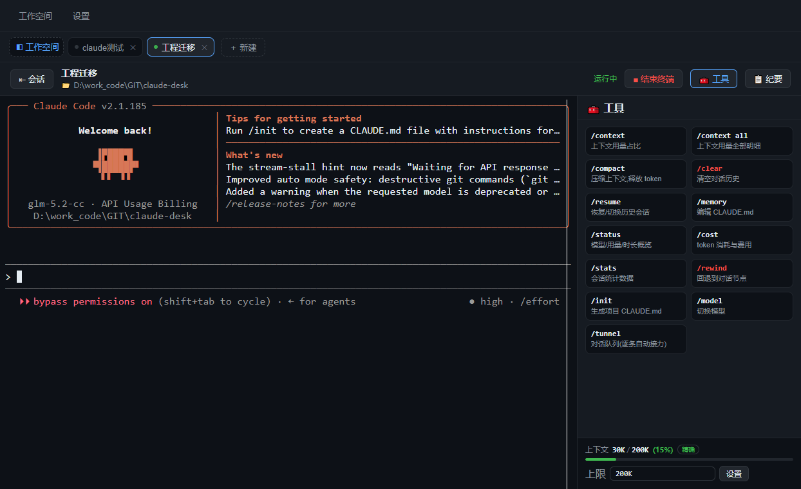

# Claude Desk

可视化 **Claude Code** 的桌面会话管理窗口（Electron + SvelteKit）。

点击「会话」或「新建会话」即**在主界面直接打开一个真实 claude 交互终端**：自动进入该会话的工作目录、套用会话配置的参数，对话效果与终端 100% 一致（权限确认 / `/retry` `/rewind` / Ctrl+C / 状态栏 全部原样）。这个壳负责"会话管理 + 起终端 + 状态"，把 claude 的对话管理起来。



> **一句话**：Claude Desk 是「会话管理壳」——每个会话背后都是一条真实的 `claude` 进程，对话手感、权限确认与终端里完全一致；它只负责把「多个会话的桌面管理」做得更顺，不改变模型行为。

## 核心亮点

- **多会话并行，互不打断**：顶部 tab 栏同时开多个会话，各自一条真实 claude，切换标签/页面**不中断进程**，终端常驻、无缝恢复重附着
- **会话有记忆、可检索**：自动绑定目录与参数、按首条提问自动命名；列表按天分组、筛选（今天/昨天/任意日期）、分页；保留剥离 ANSI 的完整实录随时回看
- **「问完答完才总结」的纪要**：按语义判定一轮问答结束（提问→有输出→输出停滞）才摘录，交给真实 claude 提炼 `【时间】👤提问 / 🤖回答要旨`，增量合并不重复调用
- **上下文占用量化监控**：实时显示 `已用/上限 (百分比)`，彩色占比条分级预警（≥75% 红 / ≥50% 黄），支持「精确 / claude实测 / 估算」三档数据源
- **斜杠命令 + 一键压缩**：`/context` `/compact` `/clear` `/rewind` `/resume` `/memory` `/model` 全部由 claude TUI 原生处理；`/compact` 自动轮询确认并替你还回 `y`
- **批量喂题：对话队列**：多条问题排队，答完一条自动发下一条；支持暂停/停止/编辑/删除，条目持久化
- **环境配置图形化**：命名配置模板（hooks/MCP/system prompt 一键写入）、白名单三件套 `settings.json` / `settings.local.json` / `CLAUDE.md` 直接编辑（语法高亮 + 原子写入）
- **桌面应用该有的体贴**：暗/亮主题跟随 Windows 原生标题栏、关窗防误杀确认、缩小到托盘常驻、F11 全屏；全部数据本地落盘不联网上传

## 功能特性

- **终端即对话**：每个会话一条真实交互式 claude 进程（PTY），点开即用、可结束/重开，**终端常驻、切换标签/页面不中断**，互不干扰
- **目录/参数记忆**：会话绑定本地工作目录与 claude 启动参数，打开后自动 `cd` 到该目录并带上参数
- **多会话并行**：顶部多会话 tab 栏，可同时打开多个会话的终端，任一可单独结束
- **会话纪要（右侧面板）**：实时记录终端实录（剥 ANSI 落盘），可随时回顾；一键「AI 深度总结」把实录交给真实 claude 生成分类纪要
- **会话管理**：按天筛选、分页（每页 20 条）、删除、运行状态、上下文 token 统计
- **自动命名**：未填名称的会话，终端实录里出现第一条提问时自动以提问内容生成标题（不再显示「未命名会话」）
- **配置文件白名单编辑**：仅允许读写 `~/.claude/settings.json`、`settings.local.json`、`CLAUDE.md`（JSON 先校验格式，原子写入，禁止任意路径）；编辑区带 JSON/Markdown 语法高亮
- **命名配置模板**：把常用 settings 存成模板，一键应用；新建/编辑均支持内容回显与语法高亮
- **本地持久化**：会话、设置、模板全部本地落盘

## 技术栈

| 层 | 技术 |
| --- | --- |
| 桌面壳 | Electron（主进程 `electron/main.cjs` + 预加载 `preload.cjs`） |
| 真实终端 | `node-pty`（PTY，主进程）+ `@xterm/xterm`（渲染进程） |
| 前端 | SvelteKit + Svelte 5 + Vite（`adapter-static` 产出静态文件） |
| 静态伺服 | `sirv` 内置 HTTP server 提供 `build/` 产物 |
| 打包 | `electron-builder`（Linux: AppImage / tar.gz；Windows: portable / zip） |

## 环境要求

- Node.js 18.17+（Vite 6 要求）
- `claude` CLI 可用（在 PATH 中，或在设置页指定二进制路径）
- `node-pty`（原生 N-API 模块，安装时优先下载平台 prebuilt，失败需编译工具链 gcc/make/python）

## 开发

```bash
npm install

# 构建前端 + 启动桌面应用（本地完整跑，推荐）
npm run app

# 仅启动前端热更新（配合 Electron 使用场景较少）
npm run dev
```

## 打包

图标放 `assets/`（Linux 用 `icon.png`，Windows 用 `icon.ico`，构建时自动引用）。

```bash
npm run dist:linux   # Ubuntu: 构建 + 打 AppImage / tar.gz
npm run dist:win     # Windows: 构建 + 打 portable exe / zip
```

> Windows 包可在 Linux 上交叉构建，electron-builder 已内置 PE 处理，**无需 wine**；两个脚本都先 `vite build` 再 `electron-builder`，产物输出到 `dist/`（已 gitignore）。
>
> **原生模块说明**：`node-pty` 自带各平台 prebuilt（`node_modules/node-pty/prebuilds/<平台>-<arch>/`），
> 已在 `electron-builder.yml` 设置 `npmRebuild: false` —— 关闭 node-gyp 从源码交叉编译（node-gyp 不支持跨平台，
> 对 win 目标会直接报 `node-gyp does not support cross-compiling native modules from source`），
> 各自打包时直接使用对应平台的 prebuilt 二进制。

产物：

| 目标 | 产物 | 说明 |
| --- | --- | --- |
| Ubuntu | `dist/Claude Desk-*.AppImage` | 免安装单文件 |
| Ubuntu | `dist/claude-desk-*.tar.gz` | 解压即用 |
| Windows | `dist/Claude Desk *.exe` | portable 免安装单文件 |
| Windows | `dist/Claude Desk-*-win.zip` | 解压即用 |

### 产物上传到 git

`dist/` 整体在 gitignore 中，但打包结果偶尔需要入库（如分发给其它机器测试），用 `-f` 强制添加即可（规则不受影响）。

```bash
git add -f "dist/Claude Desk *.exe" "dist/Claude Desk-*-win.zip"
git commit -m "更新 Windows 打包产物"
git push
```

> 注意 `git add` 的引号内是 shell 通配，需确保匹配且不包含多余旧包；二进制会永久留在 Git 历史中，仓库体积会随之增大。

### 运行前提

- 各平台均需 `claude` CLI 可用（在 PATH 中，或在设置页指定二进制路径）
- Windows 上 npm 全局安装的 claude 是 `claude.cmd`，主进程已做 shell 兼容（`electron/claude.cjs`），无需额外配置
- Ubuntu 老系统缺 `libfuse2` 时 AppImage 需先安装该库，或改用 `--appimage-extract-and-run` / 解压 tar.gz

## 自测

```bash
CD_AUTOTEST=1 npm run app        # 端到端(会话/列表/设置/配置文件模板;对话页改造后部分断言已停用)
CD_TERM_AUTOTEST=1 npm run app    # 终端主链路自测:建会话→进对话页→xterm 渲染真实 claude→
                                 #   会话页内「＋新建」客户端导航开新终端→纪要实录→切回重附着→关终端
# 主进程输出 AUTOTEST_PASS/FAIL,全部通过打印 AUTOTEST_OK ALL PASS
```

## 目录结构

```
electron/          # 主进程: main(窗口/IPC) / pty(真实终端会话) / claude(-p 消息模式) / persistence(落盘) / configs(白名单配置)
src/routes/        # SvelteKit 页面: 会话列表 / session/[id] 对话(终端视图) / settings 设置
src/lib/           # 组件(TerminalView/ChatLog/SessionForm...) 与 stores
static/            # 静态资源
build/             # 前端构建产物(adapter-static，已 gitignore)
dist/              # 打包产物(electron-builder，已 gitignore)
assets/            # 打包图标
```

## 文档

- [工具介绍](./docs/%E5%B7%A5%E5%85%B7%E4%BB%8B%E7%BB%8D.md) — 它是什么、为什么需要、核心能力、适用场景
- [使用手册](./docs/%E4%BD%BF%E7%94%A8%E6%89%8B%E5%86%8C.md) — 快速上手、会话/终端/纪要/队列/设置的完整操作说明与 FAQ
