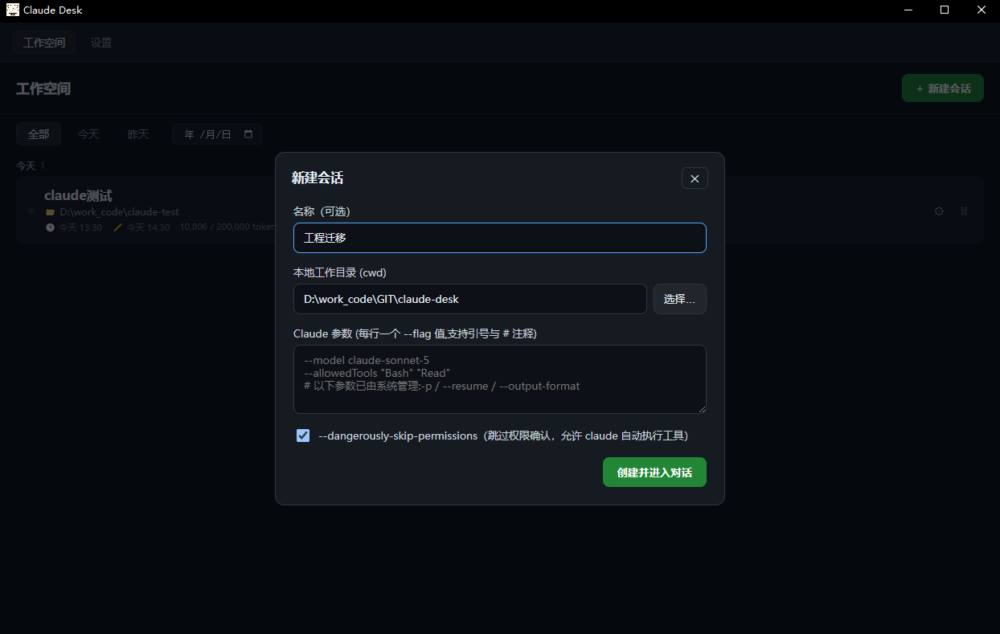
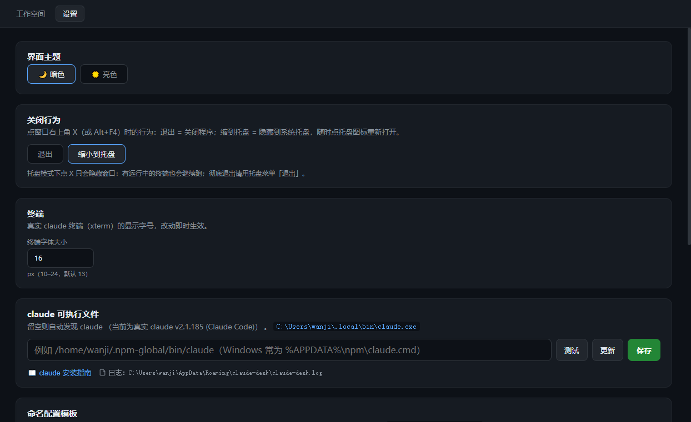

# Claude Desk 工具介绍

> 一句话：**Claude Desk 是一个把 Claude Code（命令行 claude）装进桌面的「会话管理壳」**。
> 你在它里面打开的每个会话，背后都是一条真实的 claude 进程；对话手感、权限确认、`/retry`、`/rewind` 与终端里的 claude 完全一致，它负责把你与多个 claude 会话之间的「管理」做得更顺。

---

## 为什么需要它

直接开终端跑 claude 也能工作，但场景多了就顾不过来：多个项目来回切、上下文记到哪了说不清、批量小问题只能一条条喂、一套配置换机器要重新配。

Claude Desk 把这些问题变成桌面上的**可视化会话管理**：会话、终端、上下文、纪要、配置都在一个窗口里管好，而模型本身仍是你的真实 claude，能力不缩水、行为不改变。

---

## 核心能力

### 1. 多会话并行，互不打断

- 每个会话 = 一个**工作目录 + 一组启动参数**（如 `--model`、`--allowedTools`）
- 可同时打开多个会话（顶部 tab 栏），各自一条真实 claude，切换**不中断进程**，像浏览器的多标签页
- 会话终端**常驻**：切页面、切标签再回来无缝恢复，不用重开

### 2. 会话有记忆、可检索

- 会话自动绑定目录与参数，忘了不用重敲
- 未命名会话**自动按第一条提问起标题**
- 列表按天分组、筛选（今天/昨天/任意日期）、分页；几十上百个会话也翻得动
- 每个会话保留**实录**（剥离 ANSI 的完整对话），随时回看

### 3. 「问完答完就总结」的纪要

- 右侧纪要面板判断**这一轮问答确实结束了**（用户提问 → 有实际输出 → 输出停滞）才摘录
- 交给真实 claude 提炼成 `【时间】👤 提问 / 🤖 回答要旨` 逐条摘要，**增量合并**，不重复调模型
- 打开面板即显示已存纪要，可手动「生成/重新总结」

### 4. 上下文占用量化监控

- 工具面板常显 `已用/上限 (百分比)`：如 `58K/200K (29%)`
- 彩色占比条分级预警（≥75% 红 / ≥50% 黄），超 75% 提示「建议 /compact」
- 数据源三档：`精确`（usage 真值）/ `claude`（/context 实测）/ `估算`（文本量近似，压缩后自动回落）
- 支持手动指定窗口上限（如 `200k` / `1m`）

### 5. 斜杠命令 + 一键压缩

- `/context`、`/compact`、`/clear`、`/rewind`、`/resume`、`/memory`、`/model` 等**全部由 claude TUI 原生处理**，与命令行一致
- **`/compact` 自动替你还确认**：发送后轮询确认提示并自动回 `y`，释放上下文更顺

### 6. 批量喂题：对话队列

- 多条问题排队，点开始后**答完一条自动发下一条**，逐条接力
- 支持暂停（正在答的那条答完即停）、停止、编辑/删除条目
- 条目持久化，重启仍在；执行状态在内存，重启回到未运行

### 7. 环境配置图形化

- **命名配置模板**：把一套 "hooks / MCP / system prompt" 存成模板，按项目一键写进 `settings.json`
- **白名单三件套直接编辑**：`settings.json` / `settings.local.json` / `CLAUDE.md`，带 JSON/Markdown 语法高亮、格式校验、原子写入
- claude 路径可**测试 / 设置 / 在线更新**

### 8. 桌面应用该有的体贴

- 暗 / 亮主题，Windows 原生标题栏跟随（无白条）
- 关窗时若有运行中终端先弹**确认框防误杀**；也可改为「缩小到托盘」后台常驻，托盘一键恢复
- F11 全屏；品牌启动页 + 加载动画
- 会话 / 设置 / 模板全部**本地落盘**，不联网上传（除调用 claude 本身）

---

## 适用场景

**适合：**

- 日常靠 claude 干活、要在多个项目间来回、不想丢上下文
- 需要批量给 claude 喂小问题（队列）
- 想给自己的 claude 配 hooks / MCP / 系统提示却不常碰手
- 关个窗口就怕误杀会话、想放进托盘随时回来的桌面派

**不适合 / 需留意：**

- 不是云服务：依赖本机 `claude` CLI，按你本地账号与计费走
- 能力上限就是 claude 本身——它只优化"桌面管理体验"，不改变模型行为

---

## 程序截图

---

## 技术底座

| 层 | 技术 |
| --- | --- |
| 桌面壳 | Electron（主进程 + 预加载桥） |
| 真实终端 | node-pty（主进程）+ xterm（渲染进程） |
| 前端 | SvelteKit + Svelte 5 + Vite（静态产物） |
| 静态伺服 | sirv 内置 HTTP server |
| 打包 | electron-builder（Linux / Windows） |

---

## 了解更多

- 操作细节见 [使用手册](./使用手册.md)
- 启动/打包/自测等开发信息见项目根目录 `README.md`
